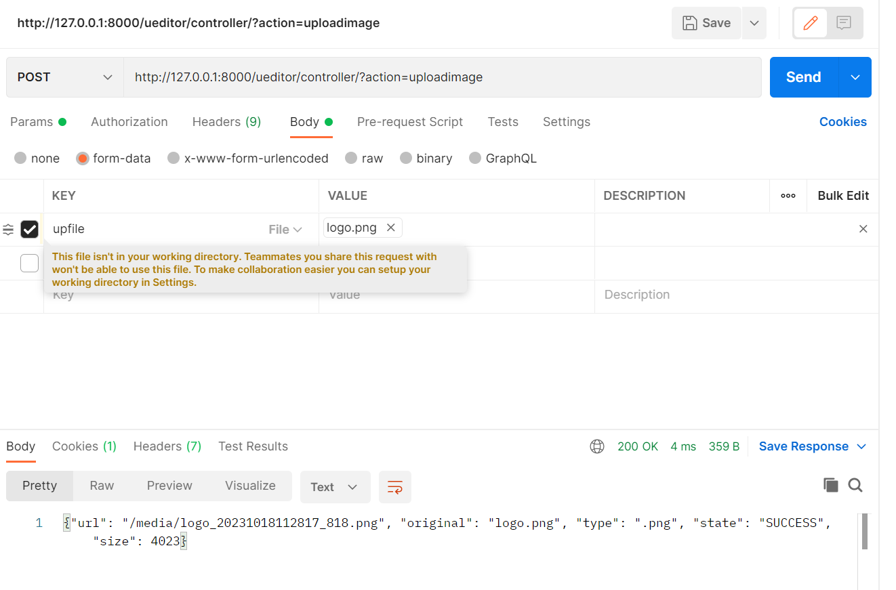
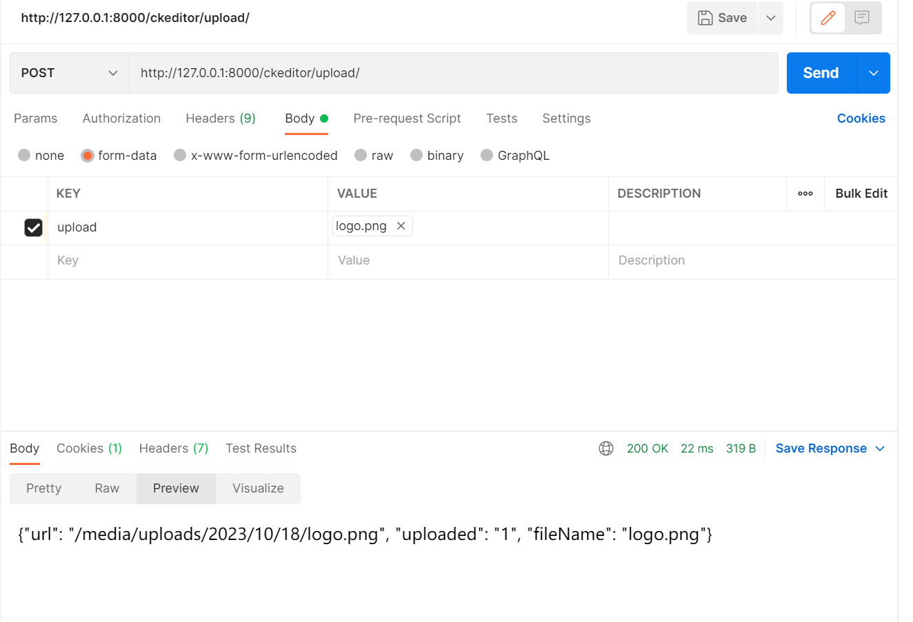
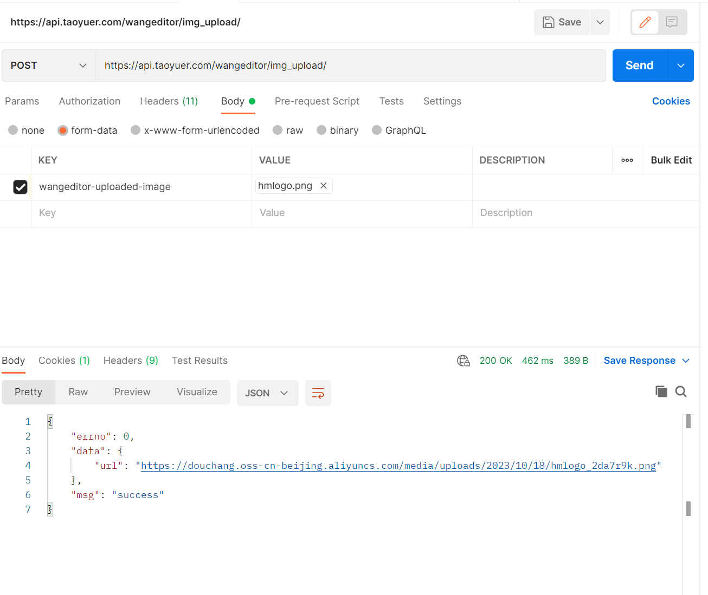

富文本编辑是内容描述必须使用的插件。在代码编写遇到很多坑，很多文档说明并不清晰，故有本代码demo。
本demo运行环境
django==3.2.13
python=3.8.12
本demo共展示3个富文本插件
1、百度富文本编辑
2、ckeditor富文本编辑器
3、wangeditor富文本编辑器

1、百度富文本编辑ueditor
直接将项目根目录文件夹（DjangoUeditor）直接拷贝到自己的项目,记得在settings.py里INSTALLED_APPS注册。
上传图片的方式和参数
请求方式：POST
字符类型File
body: 参数key upfile 
Params: action=uploadimage
详情见demo哈！

2、ckeditor富文本编辑器
需要pip安装
django-ckeditor==6.7.0
Pillow==10.1.0
请求方式：POST
字符类型File
参数key upload

3、wangeditor富文本编辑器
直接将项目根目录文件夹（DjangoUeditor）直接拷贝到自己的项目,记得在settings.py里INSTALLED_APPS注册。
请求方式：POST
字符类型File
参数key wangeditor-uploaded-image

详情见demo 有什么不会的就加我微信哈 itdongge
